Optimization Examples
=====================

**Example of optimizing lowess fit and max and redundant set selection**

.. code:: python

   import os,errno
   import dRFEtools
   import numpy as np
   import pandas as pd
   from sklearn.model_selection import KFold
   from sklearn.datasets import make_regression
   from sklearn.datasets import make_classification
   from sklearn.model_selection import StratifiedKFold
   from sklearn.model_selection import train_test_split

.. code:: python

   def mkdir_p(directory):
       try:
           os.makedirs(directory)
       except OSError as e:
           if e.errno != errno.EEXIST:
               raise

Optimize classification
-----------------------

.. code:: python

   outdir = 'classification/'
   mkdir_p(outdir)

.. code:: python

   # Create a dataset with only 10 informative features
   X, y = make_classification(
       n_samples=500, n_features=20000, n_informative=100, n_redundant=300,
       n_repeated=0, n_classes=2, n_clusters_per_class=1, random_state=13
   )

   cv = StratifiedKFold(n_splits=5, shuffle=True, random_state=13)
   #cla = dRFEtools.LogisticRegression(max_iter=1000, n_jobs=-1)
   cla = dRFEtools.RandomForestClassifier(n_estimators=100, n_jobs=-1, 
                                         oob_score=True, random_state=13)

.. code:: python

   fold = 1
   for train_index, test_index in cv.split(X, y):
       X_train, X_test = X[train_index], X[test_index]
       y_train, y_test = y[train_index], y[test_index]
       fold += 1
   fold -= 1

   features = ["feature_%d" % x for x in range(X_train.shape[1])]
   d, pfirst = dRFEtools.rf_rfe(cla, X_train, y_train, np.array(features), 
                               fold, outdir, elimination_rate=0.1, RANK=False)

Optimize lowess fit: fraction of data to use when estimating y-values
~~~~~~~~~~~~~~~~~~~~~~~~~~~~~~~~~~~~~~~~~~~~~~~~~~~~~~~~~~~~~~~~~~~~~

.. code:: python

   ## Single Fold examination
   for frac in [0.1, 0.15, 0.2, 0.25, 0.3, 0.35, 0.4]:
       dRFEtools.optimize_lowess_plot(d, fold, outdir, frac=frac, step_size=0.02, 
                                      classify=True, save_plot=True)

::

   <Figure size 432x288 with 0 Axes>

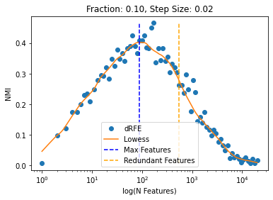

   png

::

   <Figure size 432x288 with 0 Axes>

.. figure:: optimization_files/optimization_8_3.png
   :alt: png

   png

::

   <Figure size 432x288 with 0 Axes>

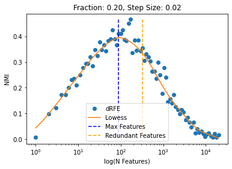

   png

::

   <Figure size 432x288 with 0 Axes>

   png

::

   <Figure size 432x288 with 0 Axes>

.. figure:: optimization_files/optimization_8_9.png
   :alt: png

   png

::

   <Figure size 432x288 with 0 Axes>

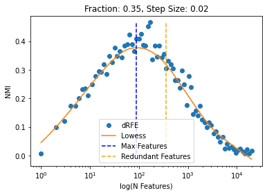

   png

::

   <Figure size 432x288 with 0 Axes>

.. figure:: optimization_files/optimization_8_13.png
   :alt: png

   png

Optimize redundant selection: examine rate change
~~~~~~~~~~~~~~~~~~~~~~~~~~~~~~~~~~~~~~~~~~~~~~~~~

.. code:: python

   for step_size in [0.01, 0.02, 0.03, 0.04, 0.05, 0.10]:
       dRFEtools.optimize_lowess_plot(d, fold, outdir, frac=0.3, step_size=step_size, 
                                      classify=True, save_plot=True)

::

   <Figure size 432x288 with 0 Axes>

.. figure:: optimization_files/optimization_10_1.png
   :alt: png

   png

::

   <Figure size 432x288 with 0 Axes>

   png

::

   <Figure size 432x288 with 0 Axes>

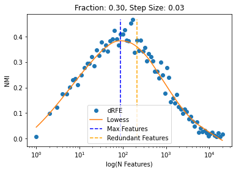

   png

::

   <Figure size 432x288 with 0 Axes>

.. figure:: optimization_files/optimization_10_7.png
   :alt: png

   png

::

   <Figure size 432x288 with 0 Axes>

   png

::

   <Figure size 432x288 with 0 Axes>

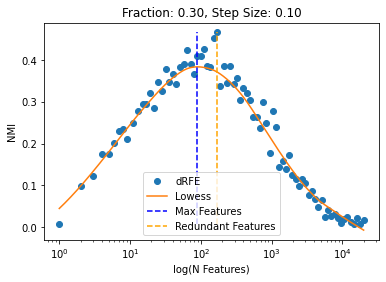

   png

.. code:: python

   ## Highest value (without smoothing)
   max(d, key=lambda x: d[x][1])

::

   170

.. code:: python

   print(dRFEtools.extract_max_lowess(d, frac=0.30))
   ## Using a conservative step size
   dRFEtools.extract_redundant_lowess(d, frac=0.30, step_size=0.02)

::

   (89, 4.4942386252808095)

   (291, 5.675040005790547)

Optimize regression
-------------------

.. code:: python

   outdir = 'regression/'
   mkdir_p(outdir)

.. code:: python

   # Create a dataset with only 10 informative features
   X, y = make_regression(
       n_samples=500, n_features=20000, n_informative=400, bias=0.02,
       n_targets=1, noise=5, random_state=13
   )
   cv = KFold(n_splits=5, shuffle=True, random_state=13)
   regr = dRFEtools.RandomForestRegressor(n_estimators=100, oob_score=True, 
                                          n_jobs=-1, random_state=13)

.. code:: python

   fold = 1
   for train_index, test_index in cv.split(X, y):
       X_train, X_test = X[train_index], X[test_index]
       y_train, y_test = y[train_index], y[test_index]
       fold += 1
   fold -= 1

   features = ["feature_%d" % x for x in range(X_train.shape[1])]
   d, pfirst = dRFEtools.rf_rfe(regr, X_train, y_train, np.array(features), 
                               fold, outdir, elimination_rate=0.1, RANK=False)

.. _optimize-lowess-fit-fraction-of-data-to-use-when-estimating-y-values-1:

Optimize lowess fit: fraction of data to use when estimating y-values
~~~~~~~~~~~~~~~~~~~~~~~~~~~~~~~~~~~~~~~~~~~~~~~~~~~~~~~~~~~~~~~~~~~~~

.. code:: python

   ## Single Fold examination
   for frac in [0.1, 0.15, 0.2, 0.25, 0.3, 0.35, 0.4]:
       dRFEtools.optimize_lowess_plot(d, fold, outdir, frac=frac, step_size=0.02, 
                                      classify=False, save_plot=True)

::

   <Figure size 432x288 with 0 Axes>

.. figure:: optimization_files/optimization_18_1.png
   :alt: png

   png

::

   <Figure size 432x288 with 0 Axes>

.. figure:: optimization_files/optimization_18_3.png
   :alt: png

   png

::

   <Figure size 432x288 with 0 Axes>

.. figure:: optimization_files/optimization_18_5.png
   :alt: png

   png

::

   <Figure size 432x288 with 0 Axes>

.. figure:: optimization_files/optimization_18_7.png
   :alt: png

   png

::

   <Figure size 432x288 with 0 Axes>

.. figure:: optimization_files/optimization_18_9.png
   :alt: png

   png

::

   <Figure size 432x288 with 0 Axes>

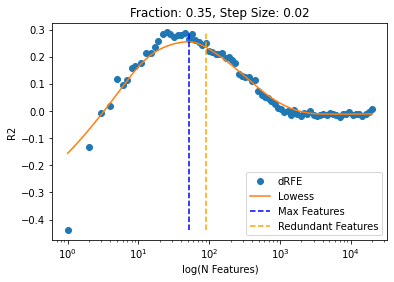

   png

::

   <Figure size 432x288 with 0 Axes>

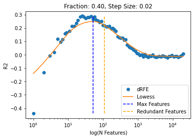

   png

.. _optimize-redundant-selection-examine-rate-change-1:

Optimize redundant selection: examine rate change
~~~~~~~~~~~~~~~~~~~~~~~~~~~~~~~~~~~~~~~~~~~~~~~~~

.. code:: python

   for step_size in [0.01, 0.02, 0.03, 0.04, 0.05, 0.1]:
       dRFEtools.optimize_lowess_plot(d, fold, outdir, frac=0.25, step_size=step_size, 
                                      classify=False, save_plot=True)

::

   <Figure size 432x288 with 0 Axes>

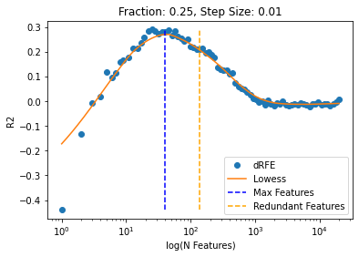

   png

::

   <Figure size 432x288 with 0 Axes>

.. figure:: optimization_files/optimization_20_3.png
   :alt: png

   png

::

   <Figure size 432x288 with 0 Axes>

   png

::

   <Figure size 432x288 with 0 Axes>

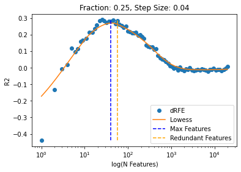

   png

::

   <Figure size 432x288 with 0 Axes>

   png

::

   <Figure size 432x288 with 0 Axes>

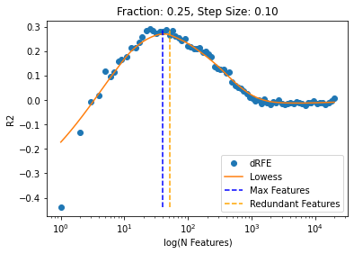

   png

.. code:: python

   ## Highest values without smoothing
   max(d, key=lambda x: d[x][1])

::

   25

.. code:: python

   print(dRFEtools.extract_max_lowess(d, frac=0.25))
   dRFEtools.extract_redundant_lowess(d, frac=0.25, step_size=0.02)

::

   (40, 3.7013019741124933)

   (110, 4.705015520957808)

Optimize classification: multi-class
------------------------------------

.. code:: python

   outdir = 'multiclass/'
   mkdir_p(outdir)

.. code:: python

   # Create a dataset with only 10 informative features
   X, y = make_classification(
       n_samples=500, n_features=20000, n_informative=100, n_redundant=300,
       n_repeated=0, n_classes=4, n_clusters_per_class=1, random_state=13
   )

   cv = StratifiedKFold(n_splits=5, shuffle=True, random_state=13)
   cla = dRFEtools.RandomForestClassifier(n_estimators=100, n_jobs=-1, 
                                         oob_score=True, random_state=13)

.. code:: python

   fold = 1
   for train_index, test_index in cv.split(X, y):
       X_train, X_test = X[train_index], X[test_index]
       y_train, y_test = y[train_index], y[test_index]
       fold += 1
   fold -= 1

   features = ["feature_%d" % x for x in range(X_train.shape[1])]
   d, pfirst = dRFEtools.rf_rfe(cla, X_train, y_train, np.array(features), 
                               fold, outdir, elimination_rate=0.1, RANK=False)

.. _optimize-lowess-fit-fraction-of-data-to-use-when-estimating-y-values-2:

Optimize lowess fit: fraction of data to use when estimating y-values
~~~~~~~~~~~~~~~~~~~~~~~~~~~~~~~~~~~~~~~~~~~~~~~~~~~~~~~~~~~~~~~~~~~~~

.. code:: python

   ## Single Fold examination
   for frac in [0.1, 0.15, 0.2, 0.25, 0.3, 0.35, 0.4]:
       dRFEtools.optimize_lowess_plot(d, fold, outdir, frac=frac, step_size=0.02, 
                                      classify=True, multi=True, save_plot=True)

::

   <Figure size 432x288 with 0 Axes>

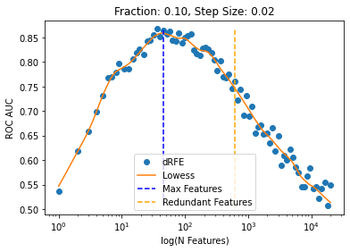

   png

::

   <Figure size 432x288 with 0 Axes>

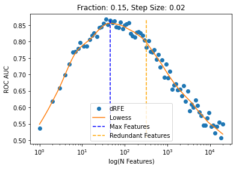

   png

::

   <Figure size 432x288 with 0 Axes>

.. figure:: optimization_files/optimization_28_5.png
   :alt: png

   png

::

   <Figure size 432x288 with 0 Axes>

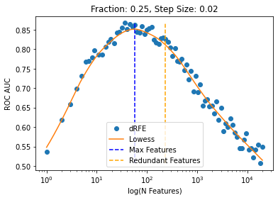

   png

::

   <Figure size 432x288 with 0 Axes>

.. figure:: optimization_files/optimization_28_9.png
   :alt: png

   png

::

   <Figure size 432x288 with 0 Axes>

.. figure:: optimization_files/optimization_28_11.png
   :alt: png

   png

::

   <Figure size 432x288 with 0 Axes>

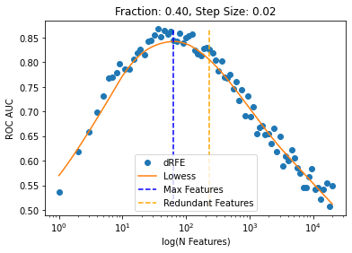

   png

.. _optimize-redundant-selection-examine-rate-change-2:

Optimize redundant selection: examine rate change
~~~~~~~~~~~~~~~~~~~~~~~~~~~~~~~~~~~~~~~~~~~~~~~~~

.. code:: python

   for step_size in [0.01, 0.02, 0.03, 0.04, 0.05, 0.1]:
       dRFEtools.optimize_lowess_plot(d, fold, outdir, frac=0.25, step_size=step_size, 
                                      classify=True, multi=True, save_plot=True)

::

   <Figure size 432x288 with 0 Axes>

.. figure:: optimization_files/optimization_30_1.png
   :alt: png

   png

::

   <Figure size 432x288 with 0 Axes>

.. figure:: optimization_files/optimization_30_3.png
   :alt: png

   png

::

   <Figure size 432x288 with 0 Axes>

.. figure:: optimization_files/optimization_30_5.png
   :alt: png

   png

::

   <Figure size 432x288 with 0 Axes>

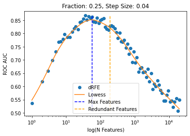

   png

::

   <Figure size 432x288 with 0 Axes>

.. figure:: optimization_files/optimization_30_9.png
   :alt: png

   png

::

   <Figure size 432x288 with 0 Axes>

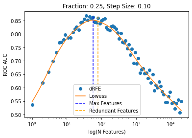

   png

.. code:: python

   ## Highest value (without smoothing)
   max(d, key=lambda x: d[x][1])

::

   28

.. code:: python

   print(dRFEtools.extract_max_lowess(d, frac=0.25))
   dRFEtools.extract_redundant_lowess(d, frac=0.25, step_size=0.015)

::

   (32, 3.481240089335692)

   (72, 4.283586561860629)

.. code:: python
